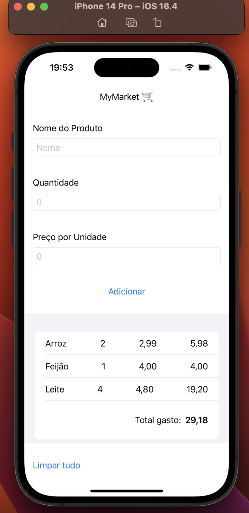
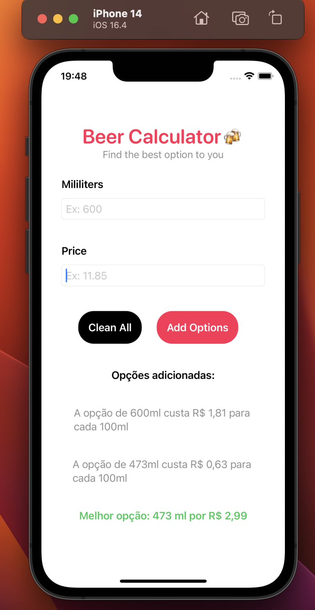
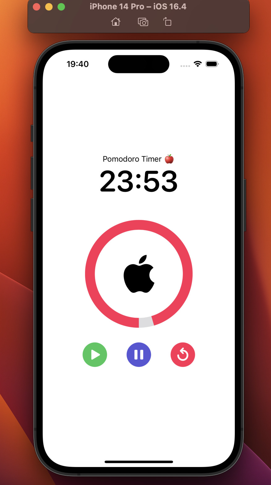
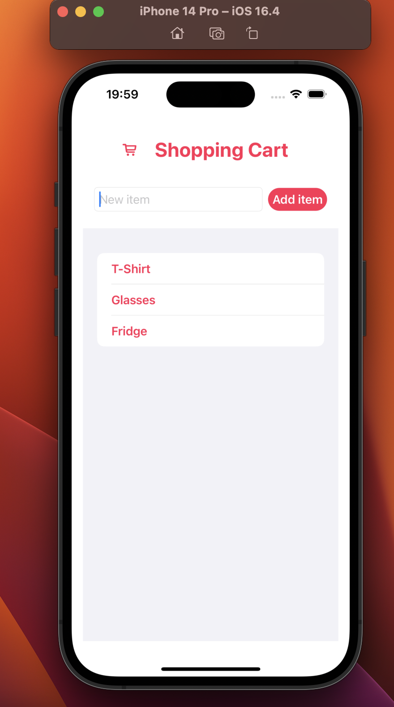

# SwiftUI
All my projects for ios devices with SwiftUI

This repository marks a new phase of my journey as a developer. In 2023, i started my first projects in SwiftUI, focusing on building optimized and up-to-date applications.

The main idea behind this repository is to store these projects and provide solutions for those seeking them. I will strive to keep the code well-documented and easy to understand. However, if you have any questions about them, feel free to reach out to me for clarification.

I rely on the participation of the community so that I can grow and, together, we can make things more accessible.

Thank you for reaching this far, and I hope you enjoy the journey! 🚀

# My Projects

| MyMarket | BeerCalculator |
| :---: | :---: |
|  |  |
| MyMarket is an app developed in SwiftUI that aims to facilitate product calculations by creating a list with prices and automatically calculating the total value whenever a new product is added. With a user-friendly interface, it provides convenience in managing your shopping needs. | BeerCalculator is my first app that helps users choose the most cost-effective drink. It calculates and compares the price per 100ml of different beverages, allowing users to make informed decisions and get the best value for their money. |

| PomodoroTimer | ShoppingCart |
| :---: | :---: |
|  |  |
| PomodoroTimer is a simple app designed to apply the Pomodoro Technique. The Pomodoro Technique is a time management method that uses a timer to break work into intervals, traditionally 25 minutes in length, separated by short breaks. It provides a focused and productive approach to manage your tasks effectively. | ShoppingCart is a project similar to MyMarket but focuses on training string storage in an array. It allows users to add items and provides visibility of the items they are purchasing. With a user-friendly interface, it simplifies the shopping experience and helps users keep track of their purchases. |
